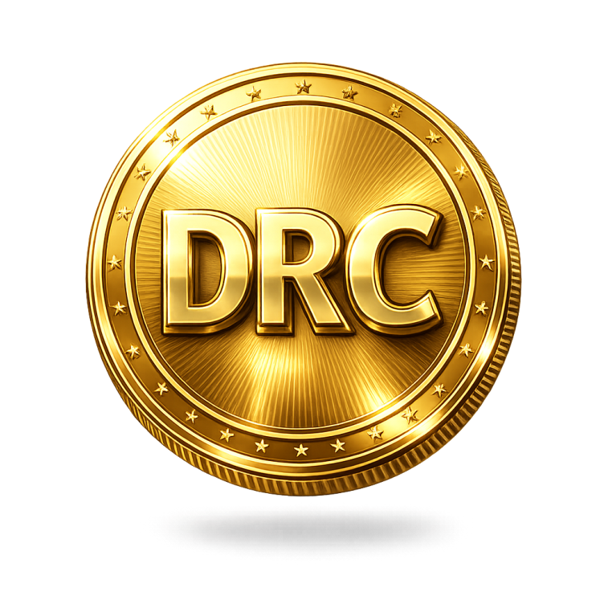

  

<h1 align="center">Daily Remit Coin (DRC)</h1>

  🌐 Future-Proof Multi-Use Cryptocurrency for Global Remittances  

  <a href="https://dailyremit.com">🌍 Website</a> •
  <a href="docs/DRC_Whitepaperv1.pdf">📄 Whitepaper</a> •
  <a href="#-social-media">📢 Socials</a>

---

## 🚀 Overview

**Daily Remit Coin (DRC)** is a next-generation digital asset designed to enable **fast, low-cost, and secure global transactions**.  
It eliminates inefficiencies in traditional remittance systems while expanding into a scalable blockchain ecosystem including:

- DeFi  
- NFTs  
- Staking  
- DAO Governance  
- Cross-chain interoperability  

---

## ⚡ Problem & Solution

### ❌ Problem
- High remittance fees  
- Slow settlement times  
- Limited global accessibility  

### ✅ Solution
DRC will provide:
- Near-instant global transfers  
- Low-cost transactions  
- Decentralized financial access  
- Borderless payments  

---

## 💎 Key Features

- 🔥 Deflationary Burn Mechanism  
- 💰 Staking Rewards  
- 📉 Supply Reduction Model  
- ⚖️ Sustainable Ecosystem Growth  
- 🌐 Multi-Chain Compatibility  
- 🛡️ Secure Smart Contracts  
- 🎨 NFT Ecosystem  
- 🏛️ DAO Governance  
- 📱 Mobile App Integration  
- 💳 Merchant Payments  

---

## 📊 Tokenomics

| Parameter        | Value |
|-----------------|------|
| Total Supply    | 1,000,000,000 DRC |
| Decimals        | 18 |
| Network         | BNB Smart Chain |

### Transaction Fees (4%)
- 1% Marketing  
- 1% Development  
- 1% Liquidity  
- 1% Burn 🔥  

---

## 🧩 Ecosystem & Use Cases

- 💸 Payments & Remittance  
- 🖼️ NFT Marketplace  
- 📊 DeFi (Staking, Yield Farming, Lending)  
- 👛 Wallet Integration  
- 🏛️ DAO Governance  
- 🔗 Cross-chain Compatibility  
- 🎮 Play-to-Earn Gaming  
- 💳 E-Commerce Payments  
- 🌍 Financial Inclusion  
- 📱 Mobile App Ecosystem  

---

## 🛠️ Technical Architecture

- Blockchain: **BNB Smart Chain (initial)**  
- Smart Contracts: Solidity  
- Future: **Own DRC Blockchain**  
- Security: Scalable & secure architecture  

---

## 🗺️ Roadmap (2026–2035)

### 📍 Phase 1: Foundation (2026)
- Launch on BSC  
- Website & branding  
- Liquidity & DEX listing  
- Community growth  

### 📍 Phase 2: Growth (2027)
- Staking platform  
- NFT marketplace  
- Partnerships  

### 📍 Phase 3: Expansion (2028–2029)
- Wallet development  
- DeFi integrations  
- Cross-chain  

### 📍 Phase 4: Maturity (2030–2032)
- DAO governance  
- Mobile apps  
- Enterprise use  

### 📍 Phase 5: Future Vision (2033–2035)
- Native blockchain  
- Global adoption  
- Institutional partnerships  

---

## 🌍 Adoption Strategy

- 📈 Exchange Listings (DEX → CEX)  
- 🤝 Strategic Partnerships  
- 📣 Influencer Campaigns  
- 🚀 Ecosystem Expansion  
- 🌐 Global Community Growth  

---

## 📄 Whitepaper

👉 [Download Whitepaper](docs/DRC_Whitepaper.pdf)

---

## 📊 Market Listings (Coming Soon)

- 🟢 CoinMarketCap (CMC): *Pending Listing*  
- 🟢 CoinGecko: *Pending Listing*  
- 🟡 PancakeSwap: *After Liquidity*  
- 🔵 Uniswap: *Future Expansion*  

---

## 📢 Social Media

- 🌐 Website: https://dailyremit.com  
- 🐦 Twitter (X): https://twitter.com/YOUR_HANDLE  
- 💬 Telegram: https://t.me/YOUR_GROUP  
- 💬 Discord: https://discord.gg/YOUR_LINK  
- 📘 Facebook: https://facebook.com/YOUR_PAGE  
- 📸 Instagram: https://instagram.com/YOUR_HANDLE  
- 📰 Medium: https://medium.com/@YOUR_HANDLE  
- ▶️ YouTube: https://youtube.com/YOUR_CHANNEL  

---

## 🔗 Blockchain & Explorer

- 🔍 BSCScan: https://bscscan.com/address/0x6eBbc9CDBb7b3fc16e117f121eC55a16f5B645fF  
- 💼 Contract Address: `0x6eBbc9CDBb7b3fc16e117f121eC55a16f5B645fF`  

---

## ⚠️ Disclaimer

DRC is under active development. Features, roadmap, and tokenomics may evolve based on market conditions and technological advancements.

---

## © License

MIT License
